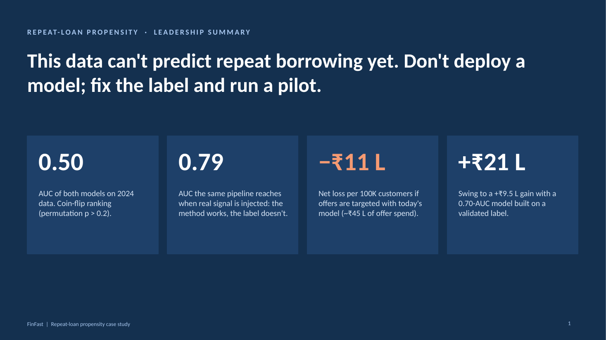
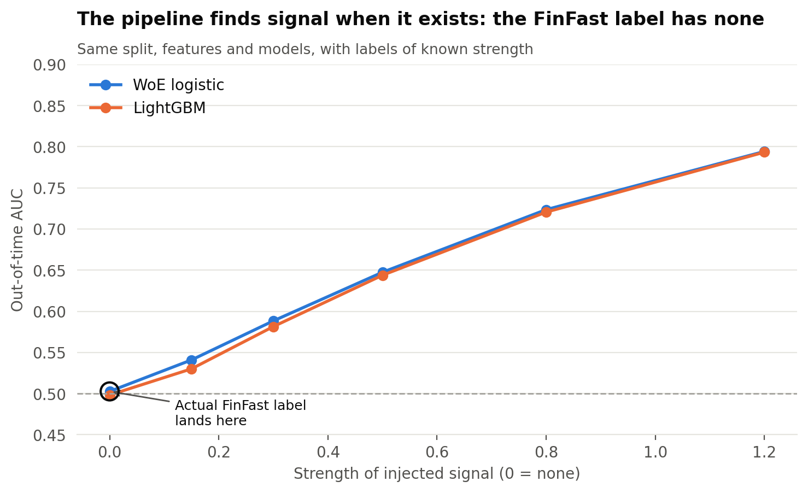
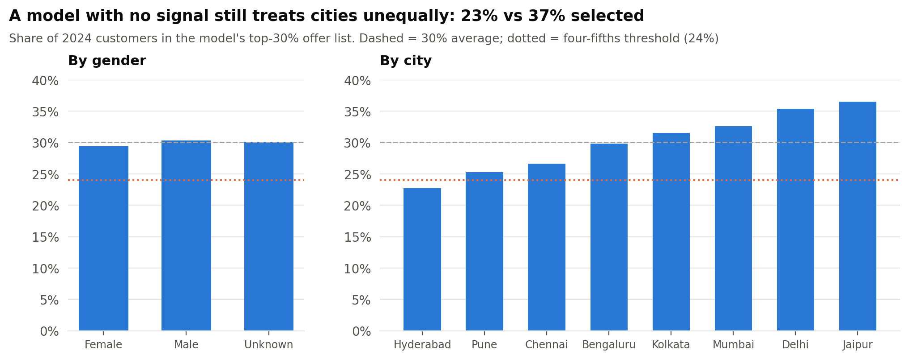
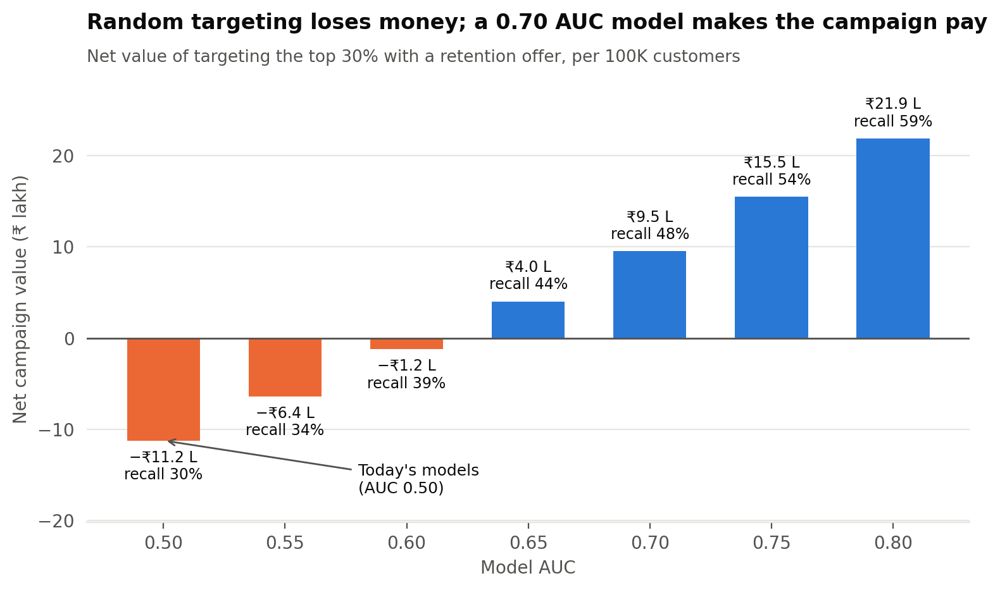

# FinFast: repeat-loan propensity modelling

A data science case study. FinFast is a digital lender offering short-tenure Retail, MSME and Consumer Durable loans. It wants to predict which borrowers will take **another loan within 12 months**, to raise repeat-loan conversion and strengthen credit decisions.



---

## The short answer

**Two properly built models (a WoE logistic scorecard and a tuned LightGBM) both score AUC 0.50 on out-of-time 2024 data. That's coin-flip ranking.** Five independent checks agree that the `repeat_loan` label carries no signal from the features provided:

| Check | Result |
|---|---|
| Information Value of all 26 features | Every feature < 0.001 (the "weak predictor" threshold is 0.02) |
| Out-of-time AUC (train 2022–23 → test 2024) | WoE logistic **0.502** (95% CI 0.496–0.509) · LightGBM **0.503** (0.496–0.510) |
| Label-permutation test | p = 0.28 and 0.22. Not better than chance |
| Random-noise feature benchmark | A random column ranks #14 of 27 by SHAP; scrambling any feature moves AUC by < 0.003 |
| **Positive control** | The *same* pipeline recovers AUC 0.54 → 0.79 when realistic signal is injected into the labels. **The method works; the label doesn't** |

The label also fails two audits: 2024 applications show the same 30% repeat rate as 2022 despite having less than 12 months of follow-up, and IDs that *do* re-apply within 12 months are flagged as repeaters only 30% of the time.

**Recommendation:** don't deploy. Fix the label at source, add the data that actually predicts repeat borrowing, and run a randomised retention pilot that also generates a causal label. Meanwhile, segment on risk × value.



---

## Answers to the business questions

### 1. Key drivers of repeat-loan behaviour

**None of the provided features drives repeat borrowing in this data.** Credit score, income, ticket size, channel, city, device, loan purpose and complaints all show the same ~30% repeat rate ([fig02](reports/figures/fig02_repeat_rate_by_feature.png)). Feature-importance charts from the models rank noise ([fig08](reports/figures/fig08_drivers_vs_noise.png)), so we don't present them as drivers.

Drivers to test once the label is fixed: first-loan repayment behaviour, time since loan closure, offer history, app engagement, and complaint *resolution*.

### 2. Credit and customer-segmentation strategy

Repeat propensity is flat across every bureau-band × ticket-size segment, so segment on **risk × value** now and add propensity later:

| Bureau band | Share | Repeat-loan strategy |
|---|---|---|
| 750+ (prime) | 21% | Pre-approved top-up at loyalty rate, instant disbursal, ≤1.5× last ticket |
| 700–749 | 7% | Pre-approved at standard rate after 3 on-time EMIs |
| 600–699 | 14% | Offer only after full on-time repayment |
| < 600 | 43% | No proactive offer; re-assess after 6 on-time EMIs |
| No score (thin-file) | 15% | Small graduated top-up to build history (growth segment) |

### 3. Retention actions for high-value customers

High-value = 750+ score, top-third ticket and income (~2.4% of the base). Each retained repeat loan is worth about ₹3K in contribution, against about ₹1.5K to acquire a replacement customer.

1. Pre-approved top-up 30–60 days before the last EMI
2. Loyalty pricing for on-time payers
3. One-tap renewal, no re-KYC
4. Fix service first: **71% of applications carry a complaint** (app crash, slow processing, errors)
5. Priority line for MSME borrowers

Measure with a randomised holdout: about **3.8K customers per arm** detects a +3 pt uplift.

### 4. Major risks

* **Leakage:** 67% of rows share a `customer_id`, so tuning uses GroupKFold by customer plus an out-of-time test. `approved_amount` is post-decision: acceptable for post-disbursal repeat scoring, but leakage in an application-time model. The label needs a 12-month maturity window.
* **Drift:** customer inputs are stable 2022–23 vs 2024 (PSI < 0.01). Only time-driven fields shift. A monthly PSI, AUC/KS and recall monitoring plan is included.
* **Bias:** gender is excluded, and selection by gender is within 3%. **City fails the four-fifths rule**: Hyderabad customers would be selected 23% of the time vs 37% in Jaipur, although actual repeat rates are identical. A model with no signal still turned city-level noise into unequal treatment.



### 5. Business impact of model performance shifts

Retention offers go to the top 30% by score. Figures are per 100K customers; assumptions are in `src/config.py`.

| Model AUC | Recall at top 30% | Net campaign value |
|---|---|---|
| 0.50 (today) | 30% | **−₹11.2 L** |
| 0.65 | 44% | +₹4.0 L |
| 0.70 | 48% | +₹9.5 L |
| 0.80 | 59% | +₹21.9 L |

**A 10-point recall drop** (48% → 38%) means 3,007 true repeaters drop off the target list, with **₹9.4 Cr** of repeat disbursal at stake and about **₹11.2 L** of expected lost contribution. Rule of thumb: 1 point of recall ≈ 300 repeaters ≈ ₹94 L of disbursal per 100K customers.



---

## Data-quality issues found

15 issues logged, fixed and flagged ([full log](notebooks/01_data_quality_eda.ipynb)). The main ones:

| Issue | Rows | Treatment |
|---|---|---|
| Same `customer_id` with different ages | 67% | Kept as applications; grouped CV; raised as a lineage question |
| `approved_amount` > `loan_amount` | 47% | Flagged (manual overrides need an audit trail) |
| Registration date after application date | 32% | Tenure set to missing; flagged |
| Gender blank / "Unknown" | 50% | Merged; gender excluded from the model |
| Income in ₹ thousands | 20% | × 1,000; flagged |
| Credit score missing | 15% | Kept as its own signal (thin-file) |
| Negative days-since-repayment | 9% | Set to missing; flagged |
| Age under 18 | 8% | Set to missing; flagged |
| Bangalore / Bengaluru | 11% | Standardised |
| Negative `approved_amount` | 1% | Set to missing; flagged |

---

## Repo structure

```
├── data/
│   ├── raw/finfast_100k_dataset.csv
│   └── processed/                  # generated by the notebooks (git-ignored)
├── notebooks/
│   ├── 01_data_quality_eda.ipynb   # cleaning log, univariate tests, IV, label audit
│   ├── 02_modelling.ipynb          # WoE scorecard vs LightGBM, permutation test, SHAP vs noise, positive control
│   └── 03_business_impact.ipynb    # drivers, segmentation, retention, drift, bias, ₹ impact
├── src/
│   ├── config.py                   # paths, feature lists, business assumptions
│   ├── cleaning.py                 # cleaning + data-quality log
│   ├── features.py                 # feature engineering (no look-ahead)
│   ├── modelling.py                # WoE logistic, LightGBM tuning, grouped CV, positive control
│   ├── evaluation.py               # metrics, gains, IV, permutation test, PSI, label audit
│   ├── impact.py                   # campaign value, recall-drop cost, A/B sample size
│   └── plots.py                    # shared chart style
├── models/                         # saved models, metrics.json, business_summary.json
├── reports/
│   ├── leadership_summary.pptx     # 7-slide business summary for leadership
│   ├── slides/                     # slide images
│   └── figures/                    # all charts
└── requirements.txt
```

## How to run

```bash
python -m venv env && source env/bin/activate
pip install -r requirements.txt
cd notebooks
jupyter nbconvert --execute --to notebook --inplace 01_data_quality_eda.ipynb
jupyter nbconvert --execute --to notebook --inplace --ExecutePreprocessor.timeout=1800 02_modelling.ipynb   # ~7 min (tuning + positive control)
jupyter nbconvert --execute --to notebook --inplace 03_business_impact.ipynb
```

Run the notebooks in order: 02 reads 01's output, and 03 reads 02's.

## Method notes

* **Split:** out-of-time (train 2022–23, test 2024) mirrors deployment. Hyper-parameter tuning uses 5-fold **GroupKFold by `customer_id`**.
* **Baseline:** Weight-of-Evidence binning (10 quantile bins + missing bin) → L2 logistic regression. This is the standard credit scorecard.
* **Advanced:** LightGBM with native categorical handling and a 12-config random search.
* **Signal tests:** IV, point-biserial / chi-square with Benjamini–Hochberg correction, bootstrap AUC CI, label-permutation test, noise-feature benchmark, positive control.
* **Business model:** the binormal model converts AUC to recall at the targeting cut-off. Margin, offer cost and offer win-rate are explicit assumptions in `config.py`, with a sensitivity table in notebook 03.
